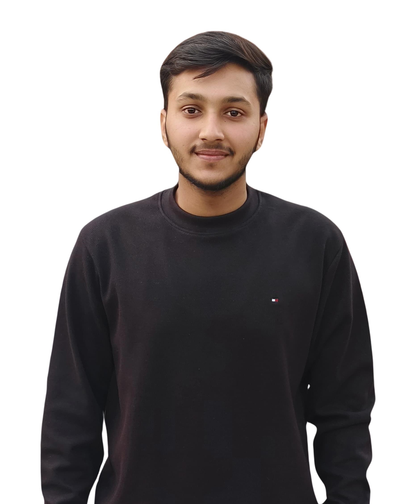

<!DOCTYPE html>
<html lang="en">
<head>
    <meta charset="UTF-8">
    <meta name="viewport" content="width=device-width, initial-scale=1.0">
    <title>Portfolio</title>
    <link rel="stylesheet" href="styles.css">
    <link rel="preconnect" href="https://fonts.googleapis.com">
    <link rel="preconnect" href="https://fonts.gstatic.com" crossorigin>
    <link href="https://fonts.googleapis.com/css2?family=Poppins:wght@300;400;500;600&display=swap" rel="stylesheet">
</head>
<body>
    <header>
        

            <h1>Personal Portfolio Website</h1>
            <nav>
                <ul>
                    <li>
                        <a href="#institution">
                            <svg class="nav-icon" viewBox="0 0 24 24">
                                <path d="M12 5.69l5 4.5V18h-2v-6H9v6H7v-7.81l5-4.5M12 3L2 12h3v8h6v-6h2v6h6v-8h3L12 3z"/>
                            </svg>
                            Home
                        </a>
                    </li>
                    <li>
                        <a href="#Srijan Srivastav">
                            <svg class="nav-icon" viewBox="0 0 24 24">
                                <path d="M12 12c2.21 0 4-1.79 4-4s-1.79-4-4-4-4 1.79-4 4 1.79 4 4 4zm0 2c-2.67 0-8 1.34-8 4v2h16v-2c0-2.66-5.33-4-8-4z"/>
                            </svg>
                            Srijan
                        </a>
                    </li>
                    <li>
                        <a href="#Sachin Yadav">
                            <svg class="nav-icon" viewBox="0 0 24 24">
                                <path d="M12 12c2.21 0 4-1.79 4-4s-1.79-4-4-4-4 1.79-4 4 1.79 4 4 4zm0 2c-2.67 0-8 1.34-8 4v2h16v-2c0-2.66-5.33-4-8-4z"/>
                            </svg>
                            Sachin
                        </a>
                    </li>
                    <li>
                        <a href="#Suraj Yadav">
                            <svg class="nav-icon" viewBox="0 0 24 24">
                                <path d="M12 12c2.21 0 4-1.79 4-4s-1.79-4-4-4-4 1.79-4 4 1.79 4 4 4zm0 2c-2.67 0-8 1.34-8 4v2h16v-2c0-2.66-5.33-4-8-4z"/>
                            </svg>
                            Suraj
                        </a>
                    </li>
                </ul>
            </nav>
        

    </header>

    <main>
        <section id="institution" class="institution">
            
            <h2>Veer Bahadur Singh Purvanchal University</h2>
            
Welcome to the portfolio of our esteemed institution. We are proud to showcase the talents and achievements of our students. Our institution is dedicated to providing high-quality education and fostering a supportive environment for personal and professional growth.

        </section>

        <section class="portfolio" id="Srijan Srivastav">
            

                
                <h3>Srijan Srivastav</h3>
                
<strong>Roll No.:</strong> 23001303066

                
<strong>Class:</strong> B.Tech (Computer Science)

                
<strong>Skills:</strong> HTML, CSS, JavaScript

                

                    <a href="https://www.linkedin.com/in/srijansrivastav29" class="linkedin-icon" target="_blank" aria-label="LinkedIn Profile">
                        <svg viewBox="0 0 24 24">
                            <path d="M19 3A2 2 0 0 1 21 5V19A2 2 0 0 1 19 21H5A2 2 0 0 1 3 19V5A2 2 0 0 1 5 3H19M18.5 18.5V13.2A3.26 3.26 0 0 0 15.24 9.94C14.39 9.94 13.4 10.46 12.92 11.24V10.13H10.13V18.5H12.92V13.57C12.92 12.8 13.54 12.17 14.31 12.17A1.4 1.4 0 0 1 15.71 13.57V18.5H18.5M6.88 8.56A1.68 1.68 0 0 0 8.56 6.88C8.56 5.95 7.81 5.19 6.88 5.19A1.69 1.69 0 0 0 5.19 6.88C5.19 7.81 5.95 8.56 6.88 8.56M8.27 18.5V10.13H5.5V18.5H8.27Z"/>
                        </svg>
                    </a>
                    <a href="mailto:srijansrivastav292005@gmail.com" class="gmail-icon" aria-label="Send Email">
                        <svg viewBox="0 0 24 24">
                            <path d="M20,8L12,13L4,8V6L12,11L20,6M20,4H4C2.89,4 2,4.89 2,6V18A2,2 0 0,0 4,20H20A2,2 0 0,0 22,18V6C22,4.89 21.1,4 20,4Z"/>
                        </svg>
                    </a>
                

                <button class="view-detail-btn">View Details</button>
            

        </section>
        
        <section class="portfolio" id="Sachin Yadav">
            

                
                <h3>Sachin Yadav</h3>
                
<strong>Roll No.:</strong>23001303048

                
<strong>Class:</strong> B.Tech (Computer Science)

                
<strong>Skills:</strong> HTML & CSS

                

                    <a href="https://www.linkedin.com/in/sachin-yadav-1b1152315" class="linkedin-icon" target="_blank" aria-label="LinkedIn Profile">
                        <svg viewBox="0 0 24 24">
                            <path d="M19 3A2 2 0 0 1 21 5V19A2 2 0 0 1 19 21H5A2 2 0 0 1 3 19V5A2 2 0 0 1 5 3H19M18.5 18.5V13.2A3.26 3.26 0 0 0 15.24 9.94C14.39 9.94 13.4 10.46 12.92 11.24V10.13H10.13V18.5H12.92V13.57C12.92 12.8 13.54 12.17 14.31 12.17A1.4 1.4 0 0 1 15.71 13.57V18.5H18.5M6.88 8.56A1.68 1.68 0 0 0 8.56 6.88C8.56 5.95 7.81 5.19 6.88 5.19A1.69 1.69 0 0 0 5.19 6.88C5.19 7.81 5.95 8.56 6.88 8.56M8.27 18.5V10.13H5.5V18.5H8.27Z"/>
                        </svg>
                    </a>
                    <a href="mailto:yadavsachin7800@gmail.com" class="gmail-icon" aria-label="Send Email">
                        <svg viewBox="0 0 24 24">
                            <path d="M20,8L12,13L4,8V6L12,11L20,6M20,4H4C2.89,4 2,4.89 2,6V18A2,2 0 0,0 4,20H20A2,2 0 0,0 22,18V6C22,4.89 21.1,4 20,4Z"/>
                        </svg>
                    </a>
                

                <button class="view-detail-btn">View Details</button>
            

        </section>
        
        <section class="portfolio" id="Suraj Yadav">
            

                
                <h3>Suraj Yadav</h3>
                
<strong>Roll No.:</strong> 23001303061

                
<strong>Class:</strong> B.Tech (Computer Science)

                
<strong>Skills:</strong> HTML & CSS

                

                    <a href="https://www.linkedin.com/in/suraj-yadav-539502325?utm_source=share&utm_campaign=share_via&utm_content=profile&utm_medium=android_app" class="linkedin-icon" target="_blank" aria-label="LinkedIn Profile">
                        <svg viewBox="0 0 24 24">
                            <path d="M19 3A2 2 0 0 1 21 5V19A2 2 0 0 1 19 21H5A2 2 0 0 1 3 19V5A2 2 0 0 1 5 3H19M18.5 18.5V13.2A3.26 3.26 0 0 0 15.24 9.94C14.39 9.94 13.4 10.46 12.92 11.24V10.13H10.13V18.5H12.92V13.57C12.92 12.8 13.54 12.17 14.31 12.17A1.4 1.4 0 0 1 15.71 13.57V18.5H18.5M6.88 8.56A1.68 1.68 0 0 0 8.56 6.88C8.56 5.95 7.81 5.19 6.88 5.19A1.69 1.69 0 0 0 5.19 6.88C5.19 7.81 5.95 8.56 6.88 8.56M8.27 18.5V10.13H5.5V18.5H8.27Z"/>
                        </svg>
                    </a>
                    <a href="mailto:yadavanshisuraj54321@gmail.com" class="gmail-icon" aria-label="Send Email">
                        <svg viewBox="0 0 24 24">
                            <path d="M20,8L12,13L4,8V6L12,11L20,6M20,4H4C2.89,4 2,4.89 2,6V18A2,2 0 0,0 4,20H20A2,2 0 0,0 22,18V6C22,4.89 21.1,4 20,4Z"/>
                        </svg>
                    </a>
                

                <button class="view-detail-btn">View Details</button>
            

        </section>
    </main>

    <footer>
        

            

                <h3>About Us</h3>
                
Welcome to our portfolio showcase at Veer Bahadur Singh Purvanchal University. We are dedicated to excellence in education and fostering the next generation of tech innovators.

                

                    <a href="#" class="social-icon">
                        <svg viewBox="0 0 24 24">
                            <path d="M12 2.04C6.5 2.04 2 6.53 2 12.06C2 17.06 5.66 21.21 10.44 21.96V14.96H7.9V12.06H10.44V9.85C10.44 7.34 11.93 5.96 14.22 5.96C15.31 5.96 16.45 6.15 16.45 6.15V8.62H15.19C13.95 8.62 13.56 9.39 13.56 10.18V12.06H16.34L15.89 14.96H13.56V21.96A10 10 0 0 0 22 12.06C22 6.53 17.5 2.04 12 2.04Z"/>
                        </svg>
                    </a>
                    <a href="#" class="social-icon">
                        <svg viewBox="0 0 24 24">
                            <path d="M22.46,6C21.69,6.35 20.86,6.58 20,6.69C20.88,6.16 21.56,5.32 21.88,4.31C21.05,4.81 20.13,5.16 19.16,5.36C18.37,4.5 17.26,4 16,4C13.65,4 11.73,5.92 11.73,8.29C11.73,8.63 11.77,8.96 11.84,9.27C8.28,9.09 5.11,7.38 3,4.79C2.63,5.42 2.42,6.16 2.42,6.94C2.42,8.43 3.17,9.75 4.33,10.5C3.62,10.5 2.96,10.3 2.38,10C2.38,10 2.38,10 2.38,10.03C2.38,12.11 3.86,13.85 5.82,14.24C5.46,14.34 5.08,14.39 4.69,14.39C4.42,14.39 4.15,14.36 3.89,14.31C4.43,16 6,17.26 7.89,17.29C6.43,18.45 4.58,19.13 2.56,19.13C2.22,19.13 1.88,19.11 1.54,19.07C3.44,20.29 5.7,21 8.12,21C16,21 20.33,14.46 20.33,8.79C20.33,8.6 20.33,8.42 20.32,8.23C21.16,7.63 21.88,6.87 22.46,6Z"/>
                        </svg>
                    </a>
                    <a href="#" class="social-icon">
                        <svg viewBox="0 0 24 24">
                            <path d="M19 3A2 2 0 0 1 21 5V19A2 2 0 0 1 19 21H5A2 2 0 0 1 3 19V5A2 2 0 0 1 5 3H19M18.5 18.5V13.2A3.26 3.26 0 0 0 15.24 9.94C14.39 9.94 13.4 10.46 12.92 11.24V10.13H10.13V18.5H12.92V13.57C12.92 12.8 13.54 12.17 14.31 12.17A1.4 1.4 0 0 1 15.71 13.57V18.5H18.5M6.88 8.56A1.68 1.68 0 0 0 8.56 6.88C8.56 5.95 7.81 5.19 6.88 5.19A1.69 1.69 0 0 0 5.19 6.88C5.19 7.81 5.95 8.56 6.88 8.56M8.27 18.5V10.13H5.5V18.5H8.27Z"/>
                        </svg>
                    </a>
                    <a href="#" class="social-icon">
                        <svg viewBox="0 0 24 24">
                            <path d="M12 2A10 10 0 0 0 2 12C2 16.42 4.87 20.17 8.84 21.5C9.34 21.58 9.5 21.27 9.5 21C9.5 20.77 9.5 20.14 9.5 19.31C6.73 19.91 6.14 17.97 6.14 17.97C5.68 16.81 5.03 16.5 5.03 16.5C4.12 15.88 5.1 15.9 5.1 15.9C6.1 15.97 6.63 16.93 6.63 16.93C7.5 18.45 8.97 18 9.54 17.76C9.63 17.11 9.89 16.67 10.17 16.42C7.95 16.17 5.62 15.31 5.62 11.5C5.62 10.39 6 9.5 6.65 8.79C6.55 8.54 6.2 7.5 6.75 6.15C6.75 6.15 7.59 5.88 9.5 7.17C10.29 6.95 11.15 6.84 12 6.84C12.85 6.84 13.71 6.95 14.5 7.17C16.41 5.88 17.25 6.15 17.25 6.15C17.8 7.5 17.45 8.54 17.35 8.79C18 9.5 18.38 10.39 18.38 11.5C18.38 15.32 16.04 16.16 13.81 16.41C14.17 16.72 14.5 17.33 14.5 18.26C14.5 19.6 14.5 20.68 14.5 21C14.5 21.27 14.66 21.59 15.17 21.5C19.14 20.16 22 16.42 22 12A10 10 0 0 0 12 2Z"/>
                        </svg>
                    </a>
                

            

            

                <h3>Quick Links</h3>
                <ul class="footer-links">
                    <li>
                        <a href="#institution">
                            <svg viewBox="0 0 24 24" width="16" height="16">
                                <path d="M12 5.69l5 4.5V18h-2v-6H9v6H7v-7.81l5-4.5M12 3L2 12h3v8h6v-6h2v6h6v-8h3L12 3z"/>
                            </svg>
                            Home
                        </a>
                    </li>
                    <li>
                        <a href="#about">
                            <svg viewBox="0 0 24 24" width="16" height="16">
                                <path d="M13,9H11V7H13M13,17H11V11H13M12,2A10,10 0 0,0 2,12A10,10 0 0,0 12,22A10,10 0 0,0 22,12A10,10 0 0,0 12,2Z"/>
                            </svg>
                            About
                        </a>
                    </li>
                    <li>
                        <a href="#portfolio">
                            <svg viewBox="0 0 24 24" width="16" height="16">
                                <path d="M19,3H5C3.89,3 3,3.89 3,5V19A2,2 0 0,0 5,21H19A2,2 0 0,0 21,19V5C21,3.89 20.1,3 19,3M19,5V19H5V5H19Z"/>
                            </svg>
                            Portfolio
                        </a>
                    </li>
                    <li>
                        <a href="#contact">
                            <svg viewBox="0 0 24 24" width="16" height="16">
                                <path d="M20,8L12,13L4,8V6L12,11L20,6M20,4H4C2.89,4 2,4.89 2,6V18A2,2 0 0,0 4,20H20A2,2 0 0,0 22,18V6C22,4.89 21.1,4 20,4Z"/>
                            </svg>
                            Contact
                        </a>
                    </li>
                </ul>
            

            

                <h3>Contact Info</h3>
                

                    

                        

                            <svg viewBox="0 0 24 24">
                                <path d="M12,11.5A2.5,2.5 0 0,1 9.5,9A2.5,2.5 0 0,1 12,6.5A2.5,2.5 0 0,1 14.5,9A2.5,2.5 0 0,1 12,11.5M12,2A7,7 0 0,0 5,9C5,14.25 12,22 12,22C12,22 19,14.25 19,9A7,7 0 0,0 12,2Z"/>
                            </svg>
                        

                        Jaunpur, Uttar Pradesh, India
                    

                    

                        

                            <svg viewBox="0 0 24 24">
                                <path d="M20,8L12,13L4,8V6L12,11L20,6M20,4H4C2.89,4 2,4.89 2,6V18A2,2 0 0,0 4,20H20A2,2 0 0,0 22,18V6C22,4.89 21.1,4 20,4Z"/>
                            </svg>
                        

                        info@university.com
                    

                    

                        

                            <svg viewBox="0 0 24 24">
                                <path d="M6.62,10.79C8.06,13.62 10.38,15.94 13.21,17.38L15.41,15.18C15.69,14.9 16.08,14.82 16.43,14.93C17.55,15.3 18.75,15.5 20,15.5A1,1 0 0,1 21,16.5V20A1,1 0 0,1 20,21A17,17 0 0,1 3,4A1,1 0 0,1 4,3H7.5A1,1 0 0,1 8.5,4C8.5,5.25 8.7,6.45 9.07,7.57C9.18,7.92 9.1,8.31 8.82,8.59L6.62,10.79Z"/>
                            </svg>
                        

                        +91 8853942888
                    

                

            

        

        

            
&copy; 2024 Veer Bahadur Singh Purvanchal University. All Rights Reserved.

        

    </footer>

    
</body>
</html>
 
